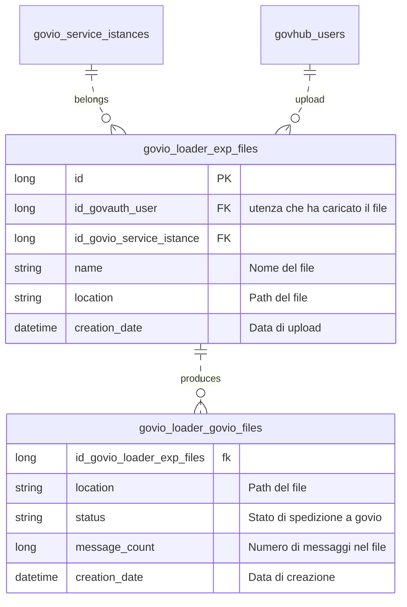

# govio-planner

Modulo di pianificazione delle notifiche IO.

## Funzionamento di base

Il servizio prevede che un cittadino venga notificato della scadenza della propria CIE 90, 60, 30 e 7 giorni prima della scadenza con un messaggio di promemoria ed un giorno dopo con la notifica dell'avvenuta scadenza. L'utente sottomette un tracciato CSV in un formato proprietario contenente, tra le altre, le informazioni necessarie alla spedizione di messaggi secondo un template configurato in GovIO. Il tracciato deve poter essere aggiornato in ogni momento andando a sostituire quello precedente nella pianificazione.

Quotidianamente un batch legge il tracciato ed individua i messaggi da spedire producendo un CSV di alimentazione di GovIO che viene successivamente caricato tramite chiamata a servizi.

## Architettura

Si prevedono i seguenti moduli:

- Rest API: API per gestire le seguenti risorse
  - /expiration_files : per l'upload, download e consultazione metadati dei tracciati csv di scadenze CIE
  - /govio_files : per download e consultazione metadati dei tracciati csv di notifiche scadenza CIE prodotti
- WebApp Angular: console di gestione con le seguenti funzioni
  - Tracciati scadenze: consente l'upload del tracciato CSV delle scadenze CIE. La sezione mostra lo storico dei tracciati caricati  la data di upload ed utente che l'ha effettuato.
  - Tracciati notifiche: permette la consultazione dei tracciati giornalieri delle notifiche e lo stato di spedizione a GovIO
- Batch di elaborazione quotidiana dei tracciati
  - Job di schedulazione: processa l'ultimo file caricato e individua nuove notifiche da inviare secondo le cadenze previste (-90/-60/-30/-7/+1) producendo un file che viene inserito nella tabella `govio_loader_govio_files`
  - Job di upload: processo che effettua l'upload dei file nella tabella `govio_loader_govio_files` a GovIO. La URL, le credenziali ed il govio_service_istances da utilizzare nell'upload è un parametro di configurazione nell'`application.properties`
 
## Note

- E' previsto un solo profilo utente per l'accesso al planner
- La cadenza di spedizione e' un parametro di configurazione (ma anche no)
- Il processamento legge l'ultima versione del CSV e la data dell'ultimo tracciato prodotto. Per ogni record controlla se la data di scadenza rientra in una delle finestre.

## Database

