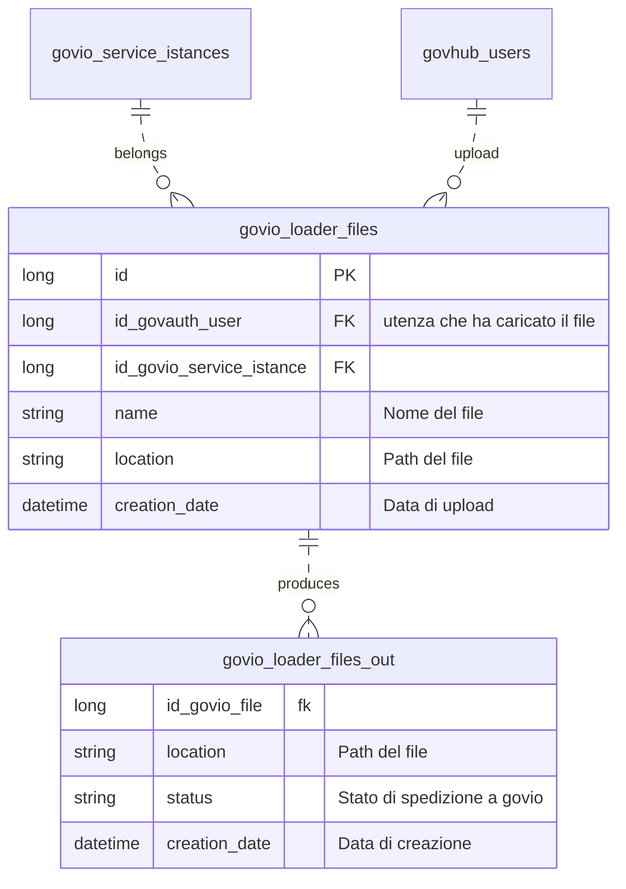

# govio-loader-cie

Modulo di pianificazione delle notifiche di spedizione per il rinnovo della CIE.

## Funzionamento di base

Il servizio prevede che un cittadino venga notificato della scadenza della propria CIE 90, 60, 30 e 7 giorni prima della scadenza con un messaggio di promemoria ed un giorno dopo con la notifica dell'avvenuta scadenza. L'utente sottomette un tracciato CSV in un formato proprietario contenente, tra le altre, le informazioni necessarie alla spedizione di messaggi secondo un template configurato so GovIO. Il tracciato deve poter essere aggiornato in ogni momento andando a sostituire quello precedente nella pianificazione.

Quotidianamente un batch legge il tracciato ed individua i messaggi da spedire producendo un CSV di alimentazione di GovIO che viene successivamente caricato tramite chiamata a servizi.

## Architettura

Si prevedono i seguenti moduli:

- Rest API: API per gestire le seguenti risorse
  - /files : per il caricamento e consultazione dei file caricati
  - /govio_files : per la consultazione dei file prodotti
- Job di elaborazione: quotidianamente elabora l'ultimo file caricato e individua nuove notifiche da inviare
- Job di upload: i tracciati prodotti al punto precedente vengono caricati in GovIO 

## Note

- Si prevede un solo profilo che garantisce i diritti per accedere risorse di cui sopra.
- Il GovIO servizi istance id e' un parametro di configurazione fisso per il file upload ed conseguente processamento
- la cadenza di spedizione e' un dato configurabile
- Il processamento legge l'ultima versione del CSV e la data dell'ultimo tracciato prodotto (nel proseguo `last`). Per ogni record controlla se da `last` alla scadenza della CIE e' decorsa una delle cadenze configurate e pianifica solo l'ultima.

## Database

